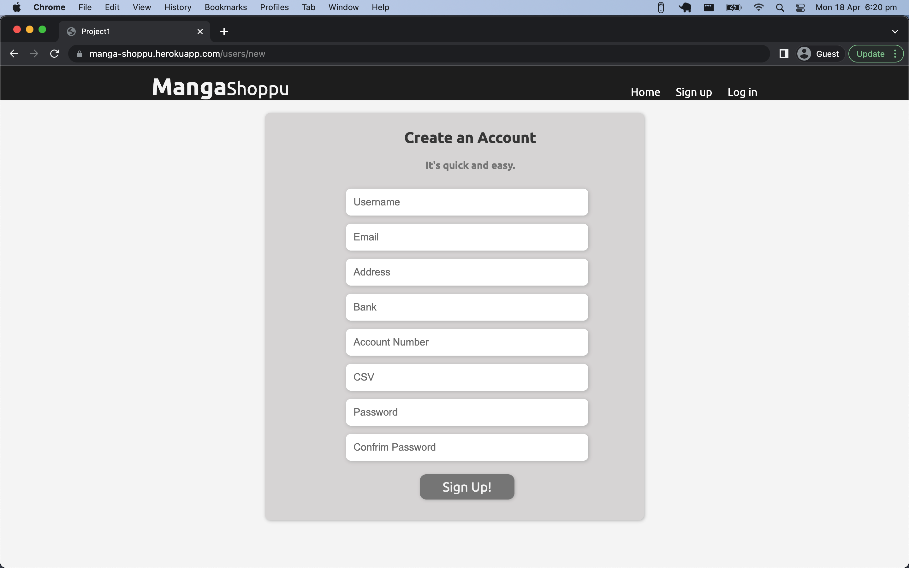
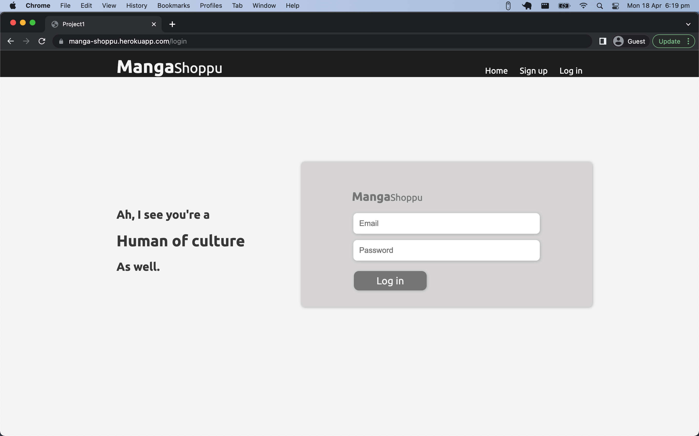
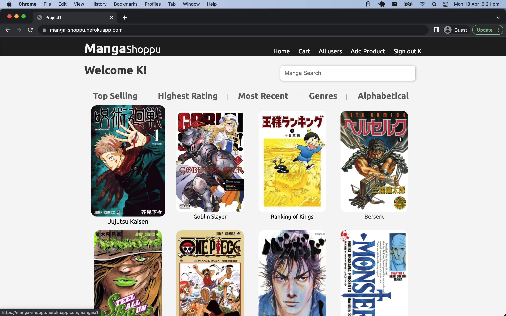
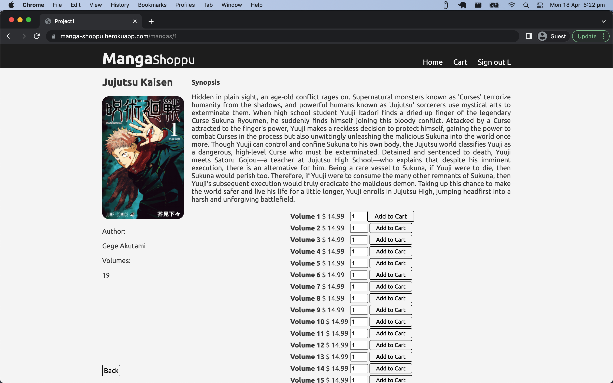
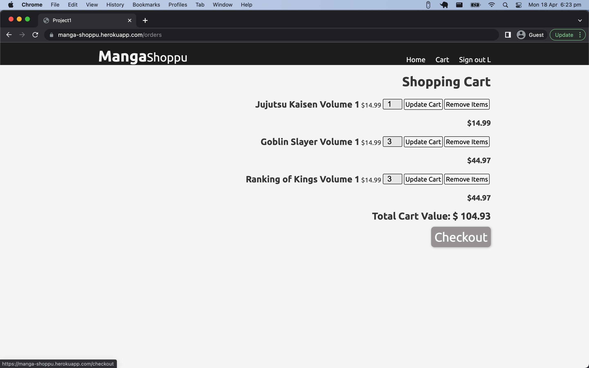

# Manga-shoppu
https://manga-shoppu.herokuapp.com/

### Logins
Admin:

`Email: kk@ga.co 
Password: chicken`

`Normal user:

Email: ll@ga.co 
Password: chicken`

Manga-shoppu is an e-commerce web application that allows users to purchase different kind of mangas. Admin users can add and edit product description, image, prices, and stock quantities. While users can add products to their carts, have a subtotal and total costs on their cart and checkout. 

## Tech Stack:
* HTML
* CSS
* Ruby
* Rails
* PostgreSQL
* Active Record
* Heroku
* Jikan API

## Functionalities
* Admin users can add and edit manga and its volumes
    - Manga ( name, images, synopsis )
    - Volumes ( name, price, stock quantity)
* Users can
    - browse the manga catalogue without creating an account
    - create an account that allows them to add items to their cart
    - Log in and Log out
    - add items to their cart once signed in
    - edit cart items (change quantity or remove item) and checkout
    - save items on their cart

## Features

* Sign up page that stores user data:
    - Username
    - Email address
    - Password
    - Address
    - Bank Account
* Log in page asks for email and password
* Manga catalogue page (populated with Manga placeholders using Jikan API)
* Manga page that display:
    - Name
    - Author
    - Synopsis
    - Volumes and volume prices
    - Add to cart button
* Cart page that display:
    - Item quantities
    - Subtotal of items
    - Total Cart value 
    - Update quantity button
    - Remove item button
    - Checkout button
* Checkout page

### Limitations
These limitations of the web app are things that I want to work on in the future. 

* User can only click on the first row mangas as the rest are placeholders (populated through Jikan API)
    - Added mangas by admin user will be functional
* User cannot edit profile or account
* User cannot view order history
* Bank account and checkout button have no functional connection
* Manga catalogue pages (Top Selling, Most Recent, etc..) are placeholders and does not direct to a new page
* Search bar is a placeholder and not functional atm (Plan to associate through Jikan API)
* Cart duplicates items in the cart instead of tallying total item quantity

### Photos

